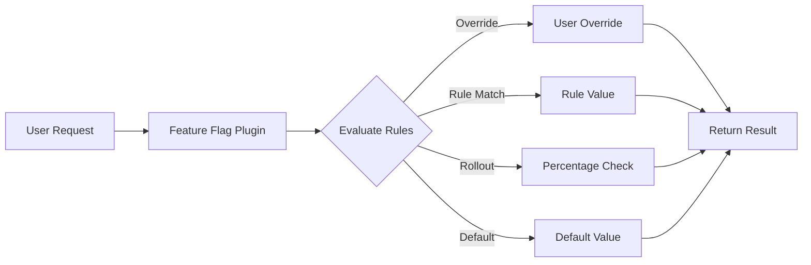

# Feature Flags Plugin

## Introduction

The **Better Auth Feature Flags** plugin provides a complete feature flag management system integrated directly with your authentication layer. Control feature rollouts, run A/B tests, and manage user experiences with powerful targeting rules and real-time evaluation.

## Key Features

::: info Core Capabilities

- **🚀 Dynamic Control** - Enable/disable features without deployments
- **🎯 Advanced Targeting** - Rule-based targeting with complex conditions
- **🧪 A/B Testing** - Multiple variants with deterministic assignment
- **🔒 Security First** - Role-based access, audit logging, and privacy controls
- **⚡ High Performance** - <100ms P99 latency at 100K+ RPS
- **🏢 Multi-tenant** - Organization-level isolation and management
  :::

## Why Feature Flags?

Feature flags enable modern software development practices:

### Progressive Rollouts

Roll out new features gradually to minimize risk:

```typescript
// Start with 10% of users
await authClient.featureFlags.admin.flags.update("<flag-id>", {
  rolloutPercentage: 10,
});

// Monitor metrics, then increase
await authClient.featureFlags.admin.flags.update("<flag-id>", {
  rolloutPercentage: 50,
});

// Full rollout when confident
await authClient.featureFlags.admin.flags.update("<flag-id>", {
  enabled: true,
  rolloutPercentage: 100,
});
```

### Instant Kill Switch

Disable problematic features immediately:

```typescript
// Emergency disable
await authClient.featureFlags.admin.flags.update("<flag-id>", {
  enabled: false,
});
```

### Targeted Experiences

Deliver personalized features based on user attributes:

```typescript
// Premium features for paid users
await authClient.featureFlags.admin.rules.create({
  flagId: "<flag-id>",
  priority: 0,
  conditions: {
    all: [{ attribute: "subscription", operator: "equals", value: "premium" }],
  },
  value: true,
});
```

## How It Works



The plugin evaluates flags in priority order:

1. **User Overrides** - Highest priority for specific users
2. **Targeting Rules** - Condition-based evaluation
3. **Percentage Rollout** - Gradual release using consistent hashing
4. **Default Value** - Fallback when no conditions match

## Architecture

### Plugin Integration

The feature flags plugin integrates seamlessly with Better Auth:

```typescript {6-8}
import { betterAuth } from "better-auth";
import { featureFlags } from "better-auth-feature-flags";

const auth = betterAuth({
  plugins: [
    featureFlags({
      // Configuration
    }),
  ],
});
```

### Storage Options

Choose the storage backend that fits your needs:

| Storage  | Use Case                    | Performance | Persistence |
| -------- | --------------------------- | ----------- | ----------- |
| Database | Production deployments      | High        | Yes         |
| Memory   | Development/testing         | Very High   | No          |
| Redis    | High-scale distributed apps | Very High   | Yes         |

### Database Schema

The plugin creates these tables in your database:

```sql
-- Core tables
featureFlag        -- Flag definitions
flagRule           -- Targeting rules
flagOverride       -- User-specific overrides

-- Analytics tables (optional)
flagEvaluation     -- Usage tracking
flagAudit          -- Change history
```

## Flag Types

Support for different data types:

### Boolean Flags

Simple on/off switches:

```typescript
{ type: "boolean", defaultValue: false }
```

### String Flags

Text values for configuration:

```typescript
{ type: "string", defaultValue: "blue" }
```

### Number Flags

Numeric values for limits or thresholds:

```typescript
{ type: "number", defaultValue: 100 }
```

### JSON Flags

Complex configuration objects:

```typescript
{
  type: "json",
  defaultValue: {
    theme: "dark",
    layout: "grid"
  }
}
```

## Evaluation Context

The plugin automatically collects context for evaluation:

```typescript
interface EvaluationContext {
  // User information
  userId?: string;
  email?: string;
  role?: string;
  organizationId?: string;

  // Device information (opt-in)
  device?: "mobile" | "tablet" | "desktop";
  browser?: string;
  os?: string;

  // Custom attributes
  attributes?: Record<string, any>;
}
```

## Performance

Optimized for production scale:

::: tip Performance Metrics

- **Evaluation Latency**: <10ms (P50), <100ms (P99)
- **Throughput**: 100,000+ evaluations/second
- **Cache Hit Rate**: >95% with proper configuration
- **Database Queries**: 1-2 per uncached evaluation
  :::

### Optimization Strategies

1. **In-memory caching** with configurable TTL
2. **Bulk evaluation** for multiple flags
3. **Connection pooling** for database efficiency
4. **Consistent hashing** for O(1) rollout decisions

## Security & Privacy

Built with security and privacy by design:

### Security Features

- ✅ Input validation and sanitization
- 🛡️ Protection against injection attacks
- 🚦 Rate limiting on evaluation endpoints
- 👤 Role-based access control for admin APIs
- 📝 Audit logging for compliance

### Privacy Controls

- 🔐 Opt-in data collection
- ⚙️ Configurable context attributes
- 🚫 No PII collection by default
- 🇪🇺 GDPR-compliant data handling
- 📅 Automatic data retention policies

## Use Cases

### Feature Rollouts

```typescript
// Gradual rollout to minimize risk
await createFlag({
  key: "new-dashboard",
  rolloutPercentage: 10, // Start with 10%
  defaultValue: false,
});
```

### A/B Testing

```typescript
// Test different variations
await authClient.featureFlags.admin.flags.create({
  key: "checkout-flow",
  name: "Checkout Flow",
  type: "json",
  enabled: true,
  defaultValue: { buttonText: "Buy Now" },
  variants: [
    { key: "control", value: { buttonText: "Buy Now" }, weight: 34 },
    { key: "variant_a", value: { buttonText: "Purchase" }, weight: 33 },
    { key: "variant_b", value: { buttonText: "Get Started" }, weight: 33 },
  ],
});
```

### Beta Features

```typescript
// Limited access for beta testers
const flag = await authClient.featureFlags.admin.flags.create({
  key: "beta-feature",
  name: "Beta Feature",
  type: "boolean",
  enabled: false,
  defaultValue: false,
});

await authClient.featureFlags.admin.rules.create({
  flagId: flag.id,
  priority: 0,
  conditions: {
    all: [{ attribute: "role", operator: "equals", value: "beta-tester" }],
  },
  value: true,
});
```

### Maintenance Mode

```typescript
// Instant feature disable for emergencies (kill switch)
await authClient.featureFlags.admin.flags.update("<flag-id>", {
  enabled: false,
});
```

## Multi-tenancy

Full support for multi-tenant applications:

```typescript
featureFlags({
  multiTenant: {
    enabled: true,
    useOrganizations: true,
  },
});

// Flags are isolated per organization when configured; admin APIs support organization scoping
await authClient.featureFlags.admin.flags.list({ organizationId: "org-123" });
```

## Analytics Integration

Track feature usage and performance:

```typescript
featureFlags({
  analytics: {
    trackUsage: true,
    trackPerformance: true,
  },
});

// Query usage data
const stats =
  await authClient.featureFlags.admin.analytics.stats.get("<flag-id>");
// { evaluations: 10000, enabled: 6000, conversion: 0.15 }
```

## Best Practices

::: warning Important Guidelines

1. **Start Small** - Begin with low rollout percentages
2. **Monitor Metrics** - Track performance and errors during rollouts
3. **Use Descriptive Keys** - Choose clear, consistent naming conventions
4. **Document Flags** - Include descriptions for team understanding
5. **Clean Up** - Remove obsolete flags regularly
6. **Test Thoroughly** - Verify flag behavior in all environments
   :::

## Comparison

How Better Auth Feature Flags compares to alternatives:

| Feature                    | Better Auth | LaunchDarkly | Unleash     | Split       |
| -------------------------- | ----------- | ------------ | ----------- | ----------- |
| Authentication Integration | ✅ Native   | ❌ Separate  | ❌ Separate | ❌ Separate |
| Self-hosted                | ✅          | ❌           | ✅          | ❌          |
| Multi-tenant               | ✅          | ✅           | ⚠️          | ✅          |
| A/B Testing                | ✅          | ✅           | ✅          | ✅          |
| Real-time Updates          | 🔜 Planned  | ✅           | ✅          | ✅          |
| Audit Logging              | ✅          | ✅           | ✅          | ✅          |
| Pricing                    | Free        | $$$          | $$          | $$$         |

## Browser Support

Works in all modern browsers and runtimes:

- ✅ Chrome 90+
- ✅ Firefox 88+
- ✅ Safari 14+
- ✅ Edge 90+
- ✅ Node.js 18+
- ✅ Deno 1.30+
- ✅ Bun 1.0+
- ✅ Cloudflare Workers

## TypeScript Support

Full TypeScript support with type inference:

```typescript
// Type-safe flag evaluation
const isDarkMode = await featureFlags.isEnabled<boolean>("dark-mode");

// Typed variants
type CheckoutVariant = {
  buttonColor: string;
  buttonText: string;
};

const variant = await featureFlags.getVariant<CheckoutVariant>("checkout-test");
```

## License

This plugin is part of the Better Auth ecosystem and follows the same licensing terms as the main Better Auth package.

## Getting Started

Ready to add feature flags to your application?

::: tip Quick Links

- **[Quickstart Guide](./quickstart.md)** - Get up and running in 5 minutes
- **[Configuration](./configuration.md)** - Detailed configuration options
- **[API Reference](./api-reference.md)** - Complete API documentation
- **[Client SDK](./client-sdk.md)** - Frontend integration guide
  :::
